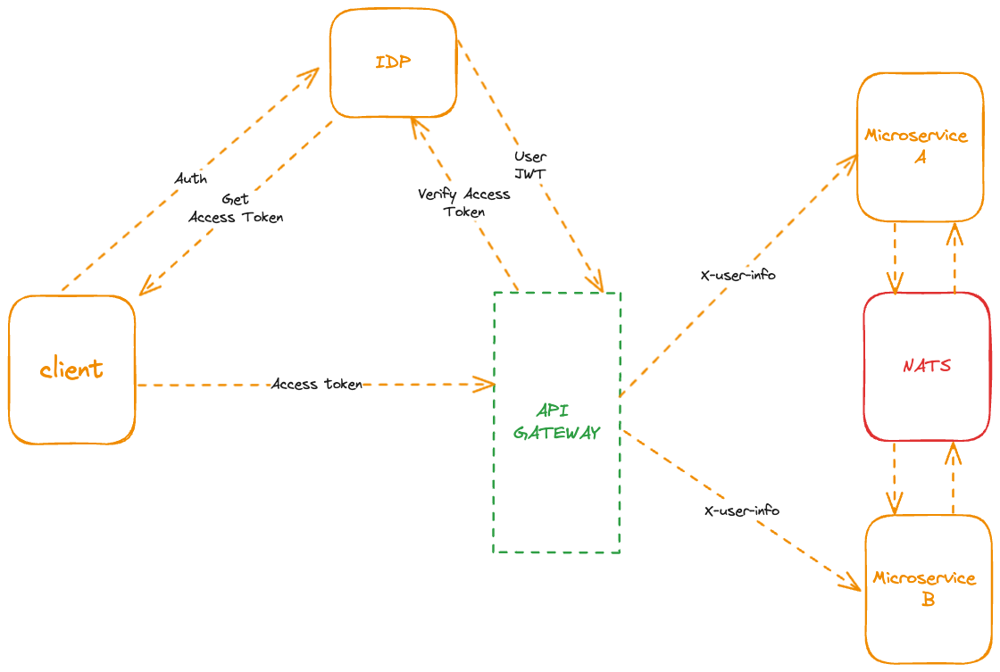

# Microservices

## Description
This project is a microservices architecture built with Nest.js, integrating an Identity Provider (IDP) for user authentication and authorization, Apache APISIX as the API Gateway to manage and route requests to various microservices, and a NATS messaging system for inter-service communication.

## Features
- User Authentication and authorization using the Identity Provider (IDP).
- Apache APISIX as API Gateway to manage and route requests to various microservices.
- API Gateway handle Authentication with IDP via Outh2
- Communication between microservices using NATS messaging system.


## Technologies Used
- Nest.js
- Authentik
- Apache APISIX
- NATS Messaging System
- OAuth2

## High level overview


## Requirements
- Docker

## Installation
1. Clone the repository:
   ```bash
   git clone https://github.com/arifhamid97/microservice.git
   cd microservice
   docker-compose -f dev.yml build
   docker-compose -f dev.yml up -d

## References
- NestJs - https://docs.nestjs.com/
- Authentik(IDP) -  https://docs.goauthentik.io/docs
- Nats - https://docs.nats.io/
- Apache APISIX - https://apisix.apache.org/docs/